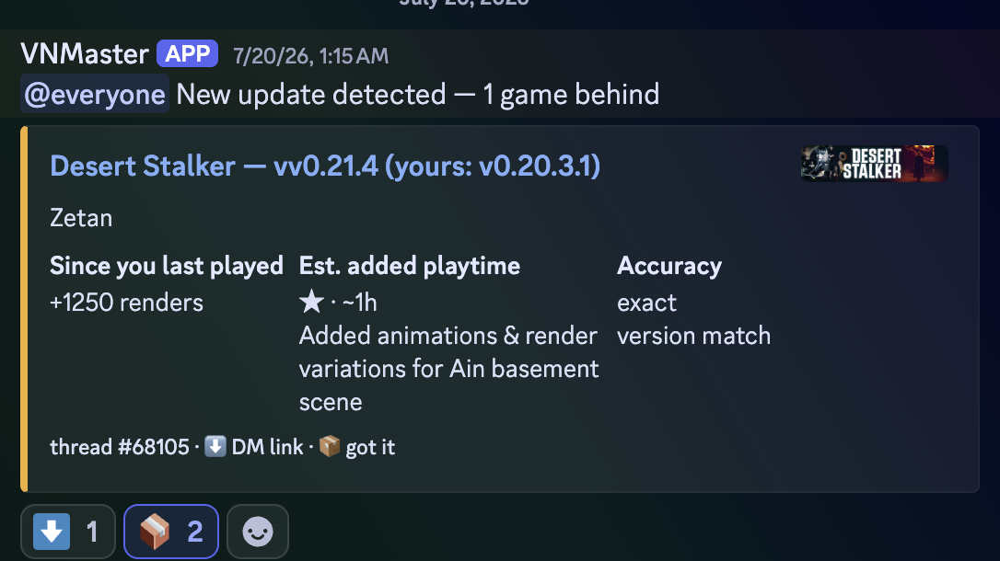

# VNMaster

Weekly Discord digest of F95Zone Ren'Py game updates with LLM-extracted
changelog magnitude.

## Table of contents

- [Discord digest preview](#discord-digest-preview)
- [Install (macOS)](#install-macos)
- [First-run](#first-run)
  - [Getting your F95Zone cookies](#getting-your-f95zone-cookies)
- [Manual smoke test](#manual-smoke-test)
- [Discord slash commands](#discord-slash-commands)
- [Download and extract a game](#download-and-extract-a-game)
- [Rebuild a downloaded game](#rebuild-a-downloaded-game)
- [Platform compatibility and contributing](#platform-compatibility-and-contributing)
- [Tests](#tests)
- [License](#license)

VNMaster is an independent, unofficial project. It is not affiliated with
F95Zone, F95Checker, Ren'Py, Discord, or any game developer or download host.
Only download and modify content you are legally authorized to use, and follow
the terms of every forum and host you access.

> [!WARNING]
> VNMaster downloads and extracts third-party games and modifications. Treat
> those files as untrusted: inspect their source, scan archives when practical,
> and do not run software you do not trust. VNMaster validates archive paths
> and size limits, but cannot establish publisher identity or code safety.

## Discord digest preview

VNMaster posts a kickoff notification followed by compact game embeds showing
the installed and available versions, changes since the game was last played,
estimated added playtime, match accuracy, and reaction-driven actions.



## Install (macOS)

```bash
uv tool install .
```

## First-run

```bash
vnmaster init
```

This wizard:
1. Confirms paths under your home directory.
2. Verifies F95Checker is installed.
3. Prompts for Anthropic API key + Discord credentials.
4. Prompts for an F95Zone `Cookie:` header (see below). Optional — if
   skipped, the wizard emits manual search URLs instead of auto-resolving
   thread URLs.
5. Scans `~/Library/RenPy/` and `~/Games/`.
6. Generates `~/.config/vnmaster/import-candidates.txt`. Review and paste
   URLs into F95Checker's bulk-import.
7. Sends a test digest.
8. Installs launchd jobs.

### Getting your F95Zone cookies

F95Zone's search endpoint returns 403 to unauthenticated requests. The wizard
can use your existing logged-in browser session if you paste the cookies:

1. Log into <https://f95zone.to> in your browser.
2. Open DevTools (Cmd-Option-I on macOS) → **Network** tab.
3. Reload the page or click any link to capture a request.
4. Click any request to `f95zone.to` → **Headers** → **Request Headers**.
5. Find the `Cookie:` line. Copy everything after `Cookie: ` (one long string
   of `name=value; name=value; ...`).
6. Paste into the wizard's "F95Zone Cookie header" prompt.

These cookies, the Discord bot token and webhook URL, and the Anthropic API key
are stored in `~/.config/vnmaster/secrets.toml` (chmod 600). F95 cookies are
domain-scoped to `f95zone.to` and are never sent to the F95Checker API or
download hosts. They expire when F95Zone logs you out — if a future
`vnmaster init` run produces all NONE rows again, refresh the cookies via the
same steps.

## Manual smoke test

After `vnmaster init`:

```bash
# 1. Start the reaction bot in the foreground (Ctrl-C to stop).
#    Slash commands and reaction handling go through this process.
#    The launchd plist installed by `init` runs it automatically; this is
#    only needed for manual debugging or first-time slash-command sync.
vnmaster bot --config ~/.config/vnmaster/config.toml

# 2. In another terminal, trigger an out-of-schedule digest run.
vnmaster digest --config ~/.config/vnmaster/config.toml

# 3. Check status.
vnmaster status

# 4. Pair a misdetected game manually (rarely needed).
vnmaster pair MyOldSaveDir https://f95zone.to/threads/foo.12345/

# 5. Tail logs.
tail -f ~/Library/Logs/VNMaster/vnmaster.log
```

You should see one Discord post in your configured channel with at least
the kickoff message; subsequent embeds appear for tracked games that have a
newer version available.

## Discord slash commands

Once the bot is running, these are available in your configured channel:

- `/vnm status` — last digest run + library + LLM spend
- `/vnm pair name:<save-or-folder-name> f95_url:<f95-thread-url>` — same as `vnmaster pair`
- `/vnm pairings` — list all save-folder → F95 thread pairings
- `/vnm unpair name:<save-dir|folder-name|thread-id>` — remove a pairing

Reactions on update embeds drive state: ⬇️ replies in-channel with the game's
F95 thread link · 📦 marks the new version grabbed.

## Download and extract a game

VNMaster can resolve an active or completed game by title, bare F95 thread ID,
or F95 thread URL and select the latest full build (macOS, then Windows, then
Linux). If a title has multiple plausible matches, VNMaster shows their title,
version, creator, and thread ID and asks which one you meant. Related patches,
walkthroughs, mods, translations, and other extras are shown as optional
downloads; nothing beyond the full game is selected automatically:

```bash
# Inspect the required build and discovered optional downloads.
vnmaster fetch "Eternum" --dry-run

# Download with MEGAcmd, then extract under ~/Games/<game>/<version>/game.
# The original full-build and selected add-on payloads are retained under archive/.
# URM is loaded from a ZIP in ~/Games/Mods and installed in the Ren'Py game folder.
vnmaster fetch "https://f95zone.to/threads/eternum.93340/"

# A bare ID and XenForo's short URL form work too.
vnmaster fetch 93340
vnmaster fetch "https://f95zone.to/threads/.93340/"

# Try PixelDrain first on each platform while retaining other mirrors.
vnmaster fetch "A Petal among Thorns" --host PIXELDRAIN

# Skip optional-content discovery and download only the full build.
vnmaster fetch "Eternum" --no-addons

# Permit an explicitly selected add-on whose reported version differs.
vnmaster fetch "Eternum" --force-incompatible-addons
```

For a normal fetch, use ↑/↓ to move through optional downloads, Space to toggle
choices, and Enter to continue. In a non-interactive shell, the fallback prompt
accepts comma-separated numbers or ranges such as `1,3-5`, `all`, or an empty
selection. Version uncertainty is shown as a warning beside the option instead
of silently hiding it. A selected add-on with a known version mismatch requires
one more interactive confirmation. Automated or `--yes` runs must use
`--force-incompatible-addons` to acknowledge that mismatch explicitly.

Configured download hosts are preferences rather than an allowlist. VNMaster
keeps every mirror for the selected build in preference/forum order, followed by
full builds for lower-priority platforms. If a host rejects the request, returns
a landing page, supplies a bad archive, or otherwise fails, the partial attempt
is removed and the next mirror is tried automatically. This means macOS mirrors
are exhausted before VNMaster falls back to Windows/Linux. `--host` moves a host
to the front within each platform but does not remove the remaining mirrors.
Optional patches and mods remain visible and use their own available mirrors.
Selected mods, patches, cheats, gallery unlocks, translations, and hotfixes are
merged into the extracted Ren'Py `game` directory. Existing files are replaced
and missing folders are created. VNMaster honors standard packaged `game/`
layouts, uses simple README instructions that explicitly request the
distribution root, and otherwise defaults to the Ren'Py `game` directory.
Before each merge it reports the target, file count, and overwrite count.
Standalone walkthroughs remain under `addons/` instead of being installed.

The complete downloaded payload is retained with the installation:

```text
~/Games/<game>/<version>/
├── game/                   # runnable extracted build with selected mods + URM
├── addons/                 # extracted optional downloads
└── archive/
    ├── <full-build>        # original game archive or downloaded payload
    └── addons/             # original payload for every selected add-on
```

VNMaster verifies the extracted payload, preserved downloads, installed
add-ons, detected Ren'Py directory, and URM before publishing the staged
installation. It stores the resulting install plan, payload checksums, and
verification results in VNMaster's SQLite database; there is no manifest JSON
beside the game.

## Rebuild a downloaded game

Use the retained payloads to undo local game changes without downloading again:

```bash
# See installations with recorded rebuild state.
vnmaster installs

# Resolve by title, F95 thread ID, or exact install path.
vnmaster rebuild "Eternum"
vnmaster rebuild 93340

# Replace successfully without retaining the modified prior game.
vnmaster rebuild "Eternum" --no-backup
```

A rebuild first verifies every retained payload against its recorded SHA-256
checksum. It then re-extracts the full build in staging, reapplies the originally
selected installable add-ons in order, installs the newest ZIP containing
`0x52_URM.rpa` from `~/Games/Mods`, and repeats structural verification. Only
then does it swap in the rebuilt `game/`. By default, the previous modified
directory is kept under `backups/<timestamp>/game`; a failed rebuild rolls back
to it automatically. Installations downloaded before state tracking was added
must be fetched again before `vnmaster rebuild` can manage them.

There is dedicated handling for MEGA, PixelDrain, public Google Drive files,
GoFile, MixDrop, DataNodes, and VikingFile, plus streaming support for direct
public HTTPS file links. GoFile and MixDrop use the project's `gallery-dl`
dependency automatically; no separate Homebrew package is needed. DataNodes and
VikingFile distinguish expired files from live links that require browser
reCAPTCHA/Turnstile, and accept the response when the host supplies file bytes
directly. A CAPTCHA-gated free link remains unavailable unattended, but it no
longer prevents VNMaster from trying the remaining mirrors. VNMaster rejects
HTML pages instead of mistaking them for an archive.

Extras that link to a specific F95 forum post are inspected for attached files.
Each attachment is offered as its own optional checkbox item and downloaded
through the same staged HTTPS path. On macOS, attached RAR patches are extracted
with the built-in `bsdtar`; no additional Homebrew package is required.

Install [MEGAcmd](https://mega.io/cmd) and launch it once before the real
download. VNMaster first resolves F95's masked link through its normal
authenticated redirect flow. If F95 conditionally requires a CAPTCHA, VNMaster
opens that page in your browser and asks you to paste the resulting MEGA or
PixelDrain URL back into the command.

## Platform compatibility and contributing

VNMaster currently supports **macOS as the host operating system**. References
to Windows and Linux elsewhere in this README describe downloadable game builds,
not operating systems on which the VNMaster CLI is fully supported.

| Capability | macOS | Linux | Windows |
| --- | --- | --- | --- |
| Install and run the CLI | Supported | Untested | Untested |
| `fetch` and `rebuild` | Supported | Core workflow is likely portable with manual configuration and tools | Ren'Py layouts are understood, but the host runtime needs portability work |
| `vnmaster init` | Supported | Not supported | Not supported |
| Scheduled digest and bot | launchd support | No systemd/cron integration | No Task Scheduler integration |
| CI coverage | Tested on `macos-15` | Not tested | Not tested |

The downloader, transactional staging, archive handling, and Ren'Py game
directory detection are mostly platform-neutral. The current host-level
limitations are:

- macOS-specific defaults under `~/Library`, including F95Checker, save, log,
  and VNMaster database locations;
- unconditional use of macOS path defaults by CLI entry points;
- launchd-only scheduler installation;
- Unix-oriented `$HOME` and secret-file permission handling;
- extractor discovery that has only been validated on macOS; and
- a macOS-only GitHub Actions test environment.

We are happy to accept pull requests that improve Linux or Windows support.
Useful contributions include platform-aware default paths, portable credential
permissions, automatic host-platform download priority, systemd/cron or Windows
Task Scheduler integration, cross-platform extractor discovery, and Linux or
Windows CI jobs. Please keep existing macOS behavior intact and include focused
tests for each new platform path.

See [CONTRIBUTING.md](CONTRIBUTING.md) for setup, testing, security, and pull
request guidance.

## Tests

```bash
uv run pytest -q
uv run ruff check src tests
uv run mypy src
```

LLM live-API tests run only when explicitly opted in:

```bash
VNMASTER_LIVE_LLM=1 uv run pytest -m live_llm -v
```

Live API tests are opt-in and must never use credentials in CI or committed
fixtures. See [SECURITY.md](SECURITY.md) for the security model and private
reporting guidance.

## License

VNMaster is available under the [MIT License](LICENSE).
